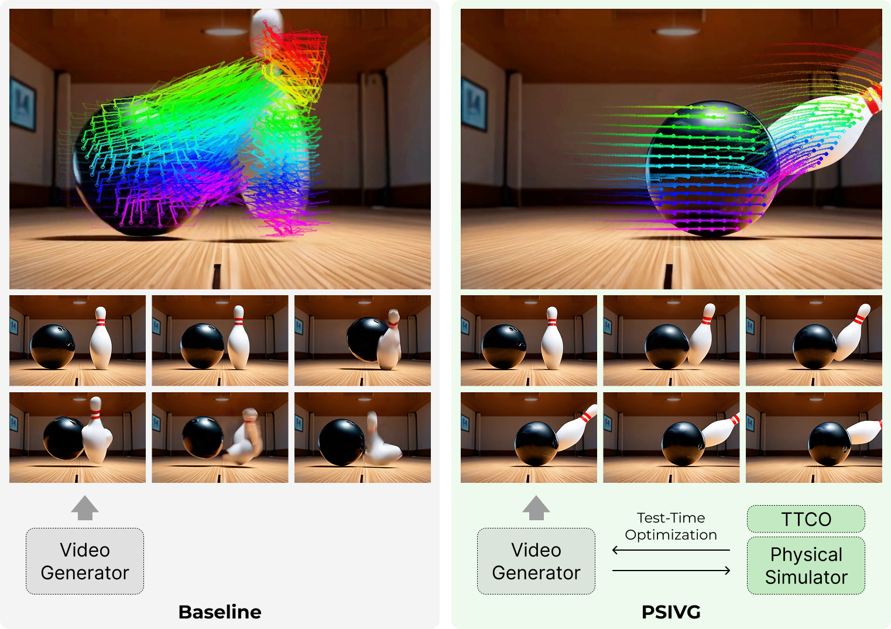

# [CVPR 2026] Physical Simulator In-the-Loop Video Generation

<div>
    <span>
        <a href="https://lingeng.foo/" target="_blank" rel="noopener noreferrer">Lin Geng
            Foo</a><sup>1,5</sup>,
    </span>
    <span>
        <a href="https://markhh.com/" target="_blank" rel="noopener noreferrer">Mark He
            Huang</a><sup>2,3</sup>,
    </span>
    <span>
        <a href="https://alexlattas.com/" target="_blank" rel="noopener noreferrer">Alexandros
            Lattas</a><sup>4</sup>,
    </span>
    <span>
        <a href="https://moschoglou.com/" target="_blank" rel="noopener noreferrer">Stylianos
            Moschoglou</a><sup>4</sup>,
    </span>
    <span>
        <a href="https://thabobeeler.com/" target="_blank" rel="noopener noreferrer">Thabo
            Beeler</a><sup>4</sup>,
    </span>
    <span>
        <a href="https://people.mpi-inf.mpg.de/~theobalt/" target="_blank" rel="noopener noreferrer">Christian Theobalt</a><sup>1,5</sup>
    </span>
</div>

<div>
    <span><sup>1</sup>Max Planck Institute for Informatics, Saarland Informatics Campus</span>,
    <span><sup>2</sup>SUTD</span>,
    <span><sup>3</sup>A*STAR</span>,
    <span><sup>4</sup>Google</span>,
    <span><sup>5</sup>Saarbrücken Research Center for
         Visual Computing, Interaction and Artificial Intelligence</span>
</div>

<br>



## Usage

Please refer to the [instructions.md](instructions.md) for environment setup and pipeline execution.

_**Disclaimer**: This repository offers a reference implementation of the pipeline described in the paper. The code is intended for research purposes only, is not optimized for robustness or production environments, and may not be actively maintained._

## License

This project is released under the [Apache 2.0 License](LICENSE).

<!-- ## BibTeX

```bibtex
@InProceedings{Foo_2026_CVPR,
  title={Physical Simulator In-the-Loop Video Generation},
  author={Foo, Lin Geng and Huang, Mark He and Lattas, Alexandros and Moschoglou, Stylianos and Beeler, Thabo and Theobalt, Christian},
  booktitle={Proceedings of the IEEE/CVF Conference on Computer Vision and Pattern Recognition (CVPR)},
  year={2026}
}
``` -->

## Acknowledgments

This project is built upon invaluable open-source research projects: [ViPE](https://github.com/nv-tlabs/vipe), [PhysGen3D](https://github.com/by-luckk/PhysGen3D), [Taichi](https://github.com/taichi-dev/taichi), [Taichi Elements](https://github.com/taichi-dev/taichi_elements), [Mitsuba](https://github.com/mitsuba-renderer/mitsuba3), [GroundingDINO](https://github.com/IDEA-Research/GroundingDINO), [SAM](https://github.com/facebookresearch/sam2), [LaMa](https://github.com/advimman/lama), [InstantMesh](https://github.com/TencentARC/InstantMesh), [lang-segment-anything](https://github.com/luca-medeiros/lang-segment-anything), [Go-with-the-Flow](https://github.com/Eyeline-Labs/Go-with-the-Flow), [cogvideox-factory](https://github.com/RyannDaGreat/cogvideox-factory).
